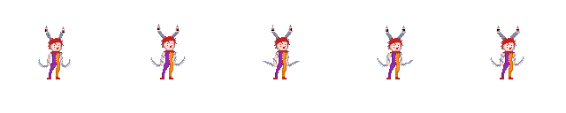
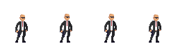
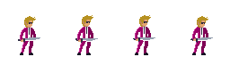
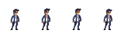
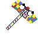

# Platform Game

A polished 2D pixel-art platformer developed with Godot 4. This project features tight movement mechanics, combat, boss fights, and a dialogue system.

  

## 🎮 Features

*   **Responsive Player Controller:**
    *   Smooth movement with acceleration/deceleration curves.
    *   **Variable Jump Height:** Control your jump height by how long you hold the button.
    *   **Coyote Time:** Grace period to jump after walking off a ledge.
    *   **Jump Buffering:** Input forgiveness for precise platforming.
    *   **Dash:** Ground and air dashing capabilities.
*   **Combat System:**
    *   Melee attacks with hitboxes.
    *   Knockback mechanics on damage.
    *   Enemy AI with state machines (Idle, Chase, Attack).
*   **Boss Battles:** Challenging boss encounters with unique behaviors (Attack, Shoot, Sprint).
*   **Interactive World:**
    *   Dialogue system with text boxes.
    *   Interactable objects like Elevators and Collectibles.
    *   Traps (Banana Peels!) and Pickups (Hammer).

## 📸 Gallery

| Hero | Boss |
| :---: | :---: |
|  |  |

| Enemies | Items |
| :---: | :---: |
|   |   |

## 🕹️ Controls

| Action | Input |
| :--- | :--- |
| **Move** | `A` / `D` or `Arrow Keys` |
| **Jump** | `Space` (Hold for higher jump) |
| **Dash** | `Shift` |
| **Attack** | `Mouse Left Click` / `Z` |
| **Interact** | `E` (Contextual) |

## 🛠️ Installation & Setup

1.  **Open with Godot 4:**
    *   Launch Godot Engine (v4.x).
    *   Click **Import**.
    *   Navigate to the project folder and select the `project.godot` file.
2.  **Run the Game:**
    *   Press `F5` to play the main scene.

## 👥 Credits

**Development Team:**

*   **Serhat Keskin** - *Core Mechanics & Physics*
*   **Beril Ozturk** - *Art & Animation*
*   **Onat Ali Arik** - *Level Design*
*   **Kaan Büyükerdem** - *Audio & Sound Design*
*   **Fikret Akbas** - *UI & Game Systems*

---
*Made with ❤️ using [Godot Engine](https://godotengine.org/).*
